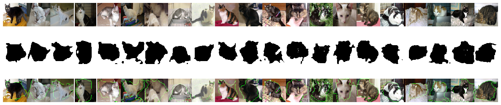

420 Assignment 3 - Report

####Q1 Image Segmentation

Code of 1.1, 1.3, 1.4 in file: 420a3q1_UNet_implementation.ipynb

Code of 1.2 in a different file: 420a3q1.2_Data_Augmentation.ipynb

#####1.1 Implement U-Net

- To implemented U-Net descripted in the paper, I did following steps:
  - Use double convolution with batch norm and RELU for layers in contracting path, and double the channel numeber when going down to next layer
  - Use maxpooling with kernel size 2 to decrease the layer size
  - Aftering reaching bottleneck, use transposed convolution for upsampling, with transposed convolution instead of upsampling, more parameters are introduced
  - Concatenate the layer with previous layer in contracting path
  - Using double convolution with batch norm and RELU for layers in expanging path, and half the channel numeber when going up to next layer
  - last layer apply convolution to make channel back to 1 and also use Sigmoid function to bound the output inside 0 and 1
- Changes made onto the U-Net:
  - Same padding and valid padding: use same padding for convolution for an easier concatenation and it will not cause any huge loss of information
  - The output is one channel instead of two channel in paper, with a one channel output, we can treat it as mask image directly and use a threshold to find the object segmentation. This makes the process later on the the predicted output easier.

```
U-Net structure:
----------------------------------------------------------------
        Layer (type)               Output Shape         Param #
================================================================
            Conv2d-1         [-1, 64, 128, 128]           1,792
       BatchNorm2d-2         [-1, 64, 128, 128]             128
              ReLU-3         [-1, 64, 128, 128]               0
            Conv2d-4         [-1, 64, 128, 128]          36,928
       BatchNorm2d-5         [-1, 64, 128, 128]             128
              ReLU-6         [-1, 64, 128, 128]               0
         MaxPool2d-7           [-1, 64, 64, 64]               0
            Conv2d-8          [-1, 128, 64, 64]          73,856
       BatchNorm2d-9          [-1, 128, 64, 64]             256
             ReLU-10          [-1, 128, 64, 64]               0
           Conv2d-11          [-1, 128, 64, 64]         147,584
      BatchNorm2d-12          [-1, 128, 64, 64]             256
             ReLU-13          [-1, 128, 64, 64]               0
        MaxPool2d-14          [-1, 128, 32, 32]               0
           Conv2d-15          [-1, 256, 32, 32]         295,168
      BatchNorm2d-16          [-1, 256, 32, 32]             512
             ReLU-17          [-1, 256, 32, 32]               0
           Conv2d-18          [-1, 256, 32, 32]         590,080
      BatchNorm2d-19          [-1, 256, 32, 32]             512
             ReLU-20          [-1, 256, 32, 32]               0
        MaxPool2d-21          [-1, 256, 16, 16]               0
           Conv2d-22          [-1, 512, 16, 16]       1,180,160
      BatchNorm2d-23          [-1, 512, 16, 16]           1,024
             ReLU-24          [-1, 512, 16, 16]               0
           Conv2d-25          [-1, 512, 16, 16]       2,359,808
      BatchNorm2d-26          [-1, 512, 16, 16]           1,024
             ReLU-27          [-1, 512, 16, 16]               0
        MaxPool2d-28            [-1, 512, 8, 8]               0
           Conv2d-29           [-1, 1024, 8, 8]       4,719,616
      BatchNorm2d-30           [-1, 1024, 8, 8]           2,048
             ReLU-31           [-1, 1024, 8, 8]               0
           Conv2d-32           [-1, 1024, 8, 8]       9,438,208
      BatchNorm2d-33           [-1, 1024, 8, 8]           2,048
             ReLU-34           [-1, 1024, 8, 8]               0
  ConvTranspose2d-35          [-1, 512, 16, 16]       2,097,664
             ReLU-36          [-1, 512, 16, 16]               0
           Conv2d-37          [-1, 512, 16, 16]       4,719,104
      BatchNorm2d-38          [-1, 512, 16, 16]           1,024
             ReLU-39          [-1, 512, 16, 16]               0
           Conv2d-40          [-1, 512, 16, 16]       2,359,808
      BatchNorm2d-41          [-1, 512, 16, 16]           1,024
             ReLU-42          [-1, 512, 16, 16]               0
  ConvTranspose2d-43          [-1, 256, 32, 32]         524,544
             ReLU-44          [-1, 256, 32, 32]               0
           Conv2d-45          [-1, 256, 32, 32]       1,179,904
      BatchNorm2d-46          [-1, 256, 32, 32]             512
             ReLU-47          [-1, 256, 32, 32]               0
           Conv2d-48          [-1, 256, 32, 32]         590,080
      BatchNorm2d-49          [-1, 256, 32, 32]             512
             ReLU-50          [-1, 256, 32, 32]               0
  ConvTranspose2d-51          [-1, 128, 64, 64]         131,200
             ReLU-52          [-1, 128, 64, 64]               0
           Conv2d-53          [-1, 128, 64, 64]         295,040
      BatchNorm2d-54          [-1, 128, 64, 64]             256
             ReLU-55          [-1, 128, 64, 64]               0
           Conv2d-56          [-1, 128, 64, 64]         147,584
      BatchNorm2d-57          [-1, 128, 64, 64]             256
             ReLU-58          [-1, 128, 64, 64]               0
  ConvTranspose2d-59         [-1, 64, 128, 128]          32,832
             ReLU-60         [-1, 64, 128, 128]               0
           Conv2d-61         [-1, 64, 128, 128]          73,792
      BatchNorm2d-62         [-1, 64, 128, 128]             128
             ReLU-63         [-1, 64, 128, 128]               0
           Conv2d-64         [-1, 64, 128, 128]          36,928
      BatchNorm2d-65         [-1, 64, 128, 128]             128
             ReLU-66         [-1, 64, 128, 128]               0
           Conv2d-67          [-1, 1, 128, 128]              65
================================================================
Total params: 31,043,521
Trainable params: 31,043,521
Non-trainable params: 0
----------------------------------------------------------------
Input size (MB): 0.19
Forward/backward pass size (MB): 216.88
Params size (MB): 118.42
Estimated Total Size (MB): 335.48
----------------------------------------------------------------
```

- Training Process:

  Training process will measure train loss and test loss for each epoch, will not save the current net unless test loss for such epoch decreased and is the smallest from all epochs. In this way, I will not store any weight from a model that has alreay overfit to the training set. Especially with smaller training set, it is easier for the model to overfit.

  Model is trained with provided 60 data with batch size 4 and epoch 10.

- Two loss functions:

  - Binary Cross Entropy: BCE will always make sence for a single class classification problem, if we denote cat (the object we want to segment) as class 1 and not cat as class 0. Since cross entropy takes log of the predict, it will punish some confident predict hardly.

    ```
    Loss computed as:loss = -(ylog(p)+(1-y)log(1-p))
    ```

  - Sørensen–Dice-coefficient:
    Sørensen–Dice-coefficient will consider the ratio of intersect area and total area. Therefore, to have a less loss, the model will try to make intersaction as big as possible. 

    

    And loss is computed by: 1 - dice score.

  ######With dice coefficient as loss function, epoch = 10

  Weight dowload link: https://drive.google.com/file/d/1-2PRco1T60zl3cCQA7kj0GNeqpn1zfeV/view?usp=sharing

  ```
  Train unet with dice coefficient as loss function...
  Start Training ...
  trianloader length:15
  testloader length:6
  saved model path:/content/drive/My Drive/csc420/unet_dice.model
  Epoch1: Save best model with test loss: 0.422.. 
  Epoch: 1/10..  Training Loss: 0.507..  Test Loss: 0.422.. 
  Epoch2: Save best model with test loss: 0.341.. 
  Epoch: 2/10..  Training Loss: 0.385..  Test Loss: 0.341.. 
  Epoch3: Save best model with test loss: 0.311.. 
  Epoch: 3/10..  Training Loss: 0.337..  Test Loss: 0.311.. 
  Epoch: 4/10..  Training Loss: 0.324..  Test Loss: 0.332.. 
  Epoch5: Save best model with test loss: 0.298.. 
  Epoch: 5/10..  Training Loss: 0.305..  Test Loss: 0.298.. 
  Epoch: 6/10..  Training Loss: 0.284..  Test Loss: 0.325.. 
  Epoch7: Save best model with test loss: 0.279.. 
  Epoch: 7/10..  Training Loss: 0.279..  Test Loss: 0.279.. 
  Epoch8: Save best model with test loss: 0.260.. 
  Epoch: 8/10..  Training Loss: 0.296..  Test Loss: 0.260.. 
  Epoch: 9/10..  Training Loss: 0.287..  Test Loss: 0.270.. 
  Epoch: 10/10..  Training Loss: 0.276..  Test Loss: 0.263.. 
  Best valuation loss: 0.259752
  
  Dice Score: 0.723
  Test Accuracy: 0.6917579287574405
  ```

  Masks:

  

  Segmentation:

  ###### With BCE as loss function, epoch = 10

  Weight dowload link: https://drive.google.com/file/d/1ILGQiiRvmXkV9uk_LYuDbooYOKasx1BD/view?usp=sharing

  ```
  Start Training ...
  trianloader length:15
  testloader length:6
  saved model path:/content/drive/My Drive/csc420/unet_bce.model
  Epoch1: Save best model with test loss: 0.533.. 
  Epoch: 1/10..  Training Loss: 0.692..  Test Loss: 0.533.. 
  Epoch2: Save best model with test loss: 0.467.. 
  Epoch: 2/10..  Training Loss: 0.600..  Test Loss: 0.467.. 
  Epoch3: Save best model with test loss: 0.417.. 
  Epoch: 3/10..  Training Loss: 0.550..  Test Loss: 0.417.. 
  Epoch: 4/10..  Training Loss: 0.521..  Test Loss: 0.422.. 
  Epoch: 5/10..  Training Loss: 0.503..  Test Loss: 0.426.. 
  Epoch6: Save best model with test loss: 0.388.. 
  Epoch: 6/10..  Training Loss: 0.495..  Test Loss: 0.388.. 
  Epoch: 7/10..  Training Loss: 0.516..  Test Loss: 0.398.. 
  Epoch8: Save best model with test loss: 0.369.. 
  Epoch: 8/10..  Training Loss: 0.483..  Test Loss: 0.369.. 
  Epoch: 9/10..  Training Loss: 0.461..  Test Loss: 0.388.. 
  Epoch: 10/10..  Training Loss: 0.466..  Test Loss: 0.383.. 
  Best valuation loss: 0.368942
  
  Dice Score: 0.600
  Test Accuracy: 0.6913364955357143
  ```

  Masks:

  

  Segmentation:

  

  Since we use dice score as an evaluation, then surely the model trained with dice loss will have a higher  dice score (dice score=0.723) than model trained with BCE (dice score=0.600). But if we look at the accuracy actually their performance are similar (both 0.69), where accuracy is computed by: 

  Correctly predicted number / total mask size.

  From masks and segmentations we can see that: with dice loss, the contour is more general more like  a box out of the object and also it has many false positive error since the contour is not approaching the contour of the cat and include some background inside. The contour is larger might because DICE loss always want to increase the intersect of true mask and predicted mask. However, BCE is much different from model with dice loss that the shape of the mask and segmentation is really unsmooth, it may fit cats more than model with dice but it also miss part of the cat by seperate them into the background. This happened may because it will has a large loss for false detection. Dice may works better since we do not want any false negative error and miss any part of the object we are interest in. But if we only look at the correct pixel number they predict, they are the almost same.

#####1.2 Data Augmentation

Weight download link with dice loss function: https://drive.google.com/file/d/1webEZQ609Otpr_IxvwtjfF5WAKyoGCP7/view?usp=sharing

Weight download link with BCE loss function: https://drive.google.com/file/d/1--qYLnxUUF5yDvRtgHl9npcYFjjTMLN3/view?usp=sharing

######4 Augmentation function:

* flip (horizontal or vertical)

* rotation with random degree

* Random Gaussian noise

* Crop image with random size

#####Unet , data augmented with DICE loss, 10 epoch:

```
Best valuation loss: 0.262879

Dice Score: 0.740
Test Accuracy: 0.6958589099702381
```

Masks:


Segmentation:



#####Unet , data augmented  with BCE loss, 10 epoch:

```
Best valuation loss: 0.361467

Dice Score: 0.579
Test Accuracy: 0.6680791945684523
```

Masks:

Segmentation:


By doing data augmentation to increase the data set, the segmentation is a more fit to the object, especially when using dice coefficient as loss function. But for model with bce loss function, some predicts become even more smaller and have a larger loss of object information. And dice coefficient and accuracy did not changed a lot with data augmentation.

##### 1.3 Transfer Learning

Weight download link: https://drive.google.com/file/d/1XGRx8LeshkX2oQFMws3Tlo_hC4S4HDc1/view?usp=sharing

- With online dataset Oxford-IIIT Pet Dataset: https://www.robots.ox.ac.uk/~vgg/data/pets/

- Since the data set has some Invalid images or masks, these images are all been removed.

- Removed dog images and only keeped images for cat, since I do not want the model to learn any information about dogs, even thogh dogs and cats have some similarities.

- I want my model learn about some basic features from a larger dataset with more cats, therefore the final training set involves different breeds of cat. In this way, the model will learn about features of different kind of cats and could recognize more kind of cats rather than only identify centrain breed of cats better.

- After pre-train the net on this larger dataset, I got a model with following loss and accuracy: 
  With about 1,200 training data, batch size 10, epoch 10:

  ```
  Best valuation loss: 0.608112
  
  Dice Score: 0.363
  Test Accuracy: 0.20617385137648808
  ```

- Fine tuning: Refine expanding path by retrain the model with all parameters of contracting layer freezed. Since, there are more parameters because of the transposed convolution in expanding path, and the first few layers will only learn some basic features about the object which could also be learn from other larger dataset that is more easier to find then the small dataset we have. The expanding path will concatenate with previous layers to increase the resolution, these information will be more valuable for object segmentation. Also because, only with pre-train model the accuracy and dice score is really low, I have to train more layers with my own small dataset again. Therefore, I choose to retrain the whole expanding path payers.

  After fine-tuning, the net on this larger dataset, I got a model with following loss and accuracy: 
  With previous 60 training data, batch size 10, epoch 10:

  ```
  Best valuation loss: 0.195477
  
  Dice Score: 0.793
  Test Accuracy: 0.7495378766741071
  ```

  Masks:

  

  Segmentation:

  

  Since I used dice loss function, I compare the result with the result of the model with dice loss. One of the problem I think previous model has is that it include too much background into the segmentation, and obviously with transfer learning the contour fit the cat better than the model before. And some masks are really similiar to the true mask. But there is still some failed segmentations.

#####1.4 Visualizing Segmentation Predictions

Fail segmentation from 1.3: fail to fit the cat and include lot of background


Good segmentation from 1.3: almost catch all cat's information and only include a small part of the background.


Fail segmentation from 1.3: almost catch all cat's information prefectly.


#### Q2 Bounding Box Design

Code of question 2 in file: 420a3q2_bounding_box_design.ipynb

##### 2.1 Problem Definition

Input: 

- A noisy image, will be converted to data type uint8 since the images will be converted from numpy array to PIL image later.

Output:

- A same size mask with black area to represent a circle. 

Loss Function:

- Mean Square Error. By computing MSE loss on two mask to check how many difference between predict mask and the true mask. 
- DICE coefficient loss function.

As for the first try I used a convolution network which is modified from YOLO net to do the detection. This network will take the image and give a output with only three numbers which are x, y and r. And I expect this model will learn from the image directly and extract the information it wants. But to train this model, huge amount of training data is needed. And because of the limitation of RAM and memory when I used Colab, the network could not provide an acceptable performance with 40,000 training data (the largest training set I could make). And also because of the complexity of the net, it overfit to small dataset easily.

Then since the limitation of the training data, I tried UNet by converting x, y, r to a mask to train the model. To find a circle in a noise image is similar to segment a class, and the class will be the edge of the circle. I choose to draw the whole circle as mask instead of only the edge. And then use MSE as main loss function to detect all difference in predicts and masks and compute the difference between then to give us a view of how the predictor behaived. And finally after get a predicted mask, I will implement some method to find edge of the circle and also center and radius.

##### 2.2 Implementation

Net Structure:

```
----------------------------------------------------------------
        Layer (type)               Output Shape         Param #
================================================================
            Conv2d-1         [-1, 32, 200, 200]             320
       BatchNorm2d-2         [-1, 32, 200, 200]              64
              ReLU-3         [-1, 32, 200, 200]               0
            Conv2d-4         [-1, 32, 200, 200]           9,248
       BatchNorm2d-5         [-1, 32, 200, 200]              64
              ReLU-6         [-1, 32, 200, 200]               0
         MaxPool2d-7         [-1, 32, 100, 100]               0
            Conv2d-8         [-1, 64, 100, 100]          18,496
       BatchNorm2d-9         [-1, 64, 100, 100]             128
             ReLU-10         [-1, 64, 100, 100]               0
           Conv2d-11         [-1, 64, 100, 100]          36,928
      BatchNorm2d-12         [-1, 64, 100, 100]             128
             ReLU-13         [-1, 64, 100, 100]               0
        MaxPool2d-14           [-1, 64, 50, 50]               0
           Conv2d-15          [-1, 128, 50, 50]          73,856
      BatchNorm2d-16          [-1, 128, 50, 50]             256
             ReLU-17          [-1, 128, 50, 50]               0
           Conv2d-18          [-1, 128, 50, 50]         147,584
      BatchNorm2d-19          [-1, 128, 50, 50]             256
             ReLU-20          [-1, 128, 50, 50]               0
        MaxPool2d-21          [-1, 128, 25, 25]               0
           Conv2d-22          [-1, 256, 25, 25]         295,168
      BatchNorm2d-23          [-1, 256, 25, 25]             512
             ReLU-24          [-1, 256, 25, 25]               0
           Conv2d-25          [-1, 256, 25, 25]         590,080
      BatchNorm2d-26          [-1, 256, 25, 25]             512
             ReLU-27          [-1, 256, 25, 25]               0
  ConvTranspose2d-28          [-1, 128, 50, 50]         131,200
             ReLU-29          [-1, 128, 50, 50]               0
           Conv2d-30          [-1, 128, 50, 50]         295,040
      BatchNorm2d-31          [-1, 128, 50, 50]             256
             ReLU-32          [-1, 128, 50, 50]               0
           Conv2d-33          [-1, 128, 50, 50]         147,584
      BatchNorm2d-34          [-1, 128, 50, 50]             256
             ReLU-35          [-1, 128, 50, 50]               0
  ConvTranspose2d-36         [-1, 64, 100, 100]          32,832
             ReLU-37         [-1, 64, 100, 100]               0
           Conv2d-38         [-1, 64, 100, 100]          73,792
      BatchNorm2d-39         [-1, 64, 100, 100]             128
             ReLU-40         [-1, 64, 100, 100]               0
           Conv2d-41         [-1, 64, 100, 100]          36,928
      BatchNorm2d-42         [-1, 64, 100, 100]             128
             ReLU-43         [-1, 64, 100, 100]               0
  ConvTranspose2d-44         [-1, 32, 200, 200]           8,224
             ReLU-45         [-1, 32, 200, 200]               0
           Conv2d-46         [-1, 32, 200, 200]          18,464
      BatchNorm2d-47         [-1, 32, 200, 200]              64
             ReLU-48         [-1, 32, 200, 200]               0
           Conv2d-49         [-1, 32, 200, 200]           9,248
      BatchNorm2d-50         [-1, 32, 200, 200]              64
             ReLU-51         [-1, 32, 200, 200]               0
           Conv2d-52          [-1, 1, 200, 200]              33
================================================================
Total params: 1,927,841
Trainable params: 1,927,841
Non-trainable params: 0
----------------------------------------------------------------
Input size (MB): 0.15
Forward/backward pass size (MB): 251.16
Params size (MB): 7.35
Estimated Total Size (MB): 258.67
----------------------------------------------------------------
```

I used a U-Net with smaller size of parameters and less layers. The U-Net has the similiar structure as q1,  with 3 layers in contracting path, 1 bottleneck layer and another 3 layers in expanding layer.  Also batchnorm and transpose convolution are used. I reduce the UNet model in q1 by reducing the channel size to have less trainable parameters. Because the image is full of noise, it does not have a lot of information contained inside, a smaller channel (with largest channel 128) for convolution will be enough for the net to learn from it. And also two layers are dropped since a 200*200 image could not processed max-pooling for more than three times. 

The net is trained with the similiar way as question 1. Evaluate current model in each epoch after training by compute the loss of all test data. And will only save model weight if and only if loss on test set decrease.
And MSE is used in 2.1 as a loss function.

Trained on the model with total 10,000 train data, batch size 20 and epoch 5.

The propose of UNet is to view circle as a object to segment and return a reasonable predicted mask. After I received the predicted mask from U-Net, I will first find strong edges in the image by computing laplacian of image. Then finding the center and radius of the circle by a process similiar to RANSAC. For some iterations, picking three points on edge and compute center and radius by math, then make a vote by all points on edges and will only return the computed result if most of the points agree with this result.

Result:
The model will have a mean iou score between 0.65 to 0.7. The model is doing a really good predict. But the method to compute center and radius is really robust and introduce some error. Also finding edges and points on edges also introduce some small error. Therefore, the total solution did not provide a better iou score.

Model download link:

https://drive.google.com/file/d/1ObiXGKpkMOhCkCvBdyh91JsmOMe2aZ0N/view?usp=sharing

#####2.3 IOU Optimization

To train the model, we have to compute the gradient of loss function. However IOU is not a differentiable function, so it could not be implemented as a loss function. 

To make IOU differentiable, some approximation may be needed.

##### 2.4 Visualization and Error Analysis

- not clear circle contour: Sometimes the edge is not clear enough (not really easily tell even by human eyes). In this case my model will fail to detect the correct edge and will have some wrong prediction. This will effect the center computing part. In most cases, the center will be computed a little bit away from the real position. One of the images below is a successful case but the mask is not prefect.

   

- Corner: When the circle is at corner, sometime there might be some wrong identification inside the circle. The predictor did not mark the area in the circle correctly. And this will influence the process that if there are some edges inside the circle contour, the predicted circle will become near to the center of the image since they will consider the pointed inside the circle as an edge of circle.

        

- Influence of strong noise: Sometimes there are some really strong noisy points outside the  circle. In this case the model will detect it and test strong feature will servive the threshold and become an edge point. So these noise points will influence the center computed hugely even if the detector also find the circle. And in this case my method could not ignore all these points, and make a wrong prediction because of these noisy points (RANSAC will not sucess if there are too many outliers). 

     

- Center and radius computation error, it is hard to show with images since few pixels difference. But this kind of small error exist all the time. The method could not perform a really stable computation with a given mask. But from plot below, we could see that the predicted mask is pretty good but the iou is 0.75 because of the small error introducted when computing center and radius.

  


####Q3 Hot Dog or Not Hot Dog

We could not identify whether the picture is hot dog or not only from a prediction from this neural network. The neural network will give a single number from a sigmoid layer, the number c should between 0 and 1. It will be considered as the probability of the network think this picture is hot dog from what it has already learnt. The probability is not same as the true label, even if the neural network give us a high value that near 1 that it thinks it must be a hot dog, it is still possible to have a wrong prodection based on what kind of dataset it learnt on with. At the same time, if the network gives us 0 that it thinks this could not be hot dog, it could also be a wrong prediction because of lack of training data.